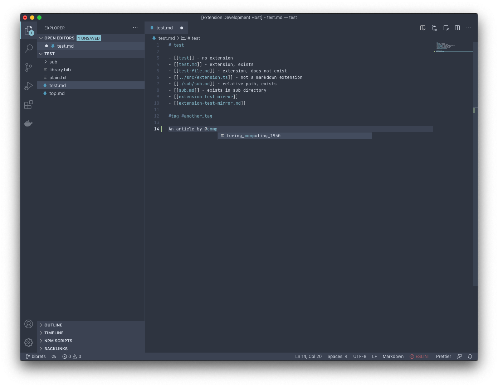

# Markdown Notes for VS Code

Use `[[wiki-links]]`, `backlinks`, `#tags` and `@bibtex-citations` for fast-navigation of markdown notes.

Automatically create notes from new inline `[[wiki-links]]`.

Bring some of the awesome features from apps like [Notational Velocity](http://notational.net/), [nvalt](https://brettterpstra.com/projects/nvalt/), [Bear](https://bear.app/), [FSNotes](https://fsnot.es/), [Obsidian](https://obsidian.md/) to VS Code, where you also have (1) Vim key bindings and (2) excellent extensibility.

[Install from the VSCode Marketplace](https://marketplace.visualstudio.com/items?itemName=kortina.vscode-markdown-notes). See more in the blog post: [Suping Up VS Code as a Markdown Notebook](https://kortina.nyc/essays/suping-up-vs-code-as-a-markdown-notebook/).

For common issues / workarounds, please see [TROUBLESHOOTING-FAQ.md](https://github.com/kortina/vscode-markdown-notes/blob/master/TROUBLESHOOTING-FAQ.md)

Also, take a look at the [RECOMMENDED-SETTINGS.md](https://github.com/kortina/vscode-markdown-notes/blob/master/RECOMMENDED-SETTINGS.md)

### `[[wiki-links]]`

A popular feature in [Roam Research](https://roamresearch.com/) and [Bear](https://bear.app/) is the ability to quickly reference other notes using "Cross-Note Links" in the `[[wiki-link]]` style.

**Markdown Notes** provides syntax highlighting, auto-complete, Go to Definition (`editor.action.revealDefinition`), and Peek Definition (`editor.action.peekDefinition`) support for wiki-links to notes in a workspace.

By default, the extension assumes each markdown file in a workspace has a unique name, so that `note.md` will resolve to the file with this name, regardless of whether or not this file exists in any subdirectory path. This tends to be a bit cleaner, but if you want support for multiple files with the same name, in `settings.json` set `"vscodeMarkdownNotes.workspaceFilenameConvention": "relativePaths"`, and you'll get completions like `note1/note.md` and `../note2/note.md`.

You can configure piped wiki-link syntax to use either `[[file|description]]`, or `[[description|file]]` format (to show pretty titles instead of filenames in your rendered HTML).

### #tags

Syntax highlighting for `#tags`.

### @bibtex-citations

Use [pandoc-style](https://pandoc.org/MANUAL.html#extension-citations) citations in your notes (eg `@author_title_year`) to get syntax highlighting, autocompletion and go to definition, if you setup a global [BibTeX file](http://www.bibtex.org/Format/) with your references.

### New Note Command

Provides a command for quickly creating a new note.

You can bind this to a keyboard shortcut by adding to your `keybindings.json`:

```json
    {
        "key": "alt+shift+n",
        "command": "vscodeMarkdownNotes.newNote",
    },
```

NB: there is also a command `vscodeMarkdownNotes.newNoteFromSelection` which will "cut" the selected text from the current document, prompt for a note name, create a new note with that name, and insert the new text into that note.

### Screenshots

#### Create New Note On Missing Go To Definition


#### Intellisense Completion for Wiki Links, `uniqueFilenames`


#### Intellisense Completion for Wiki Links, `relativePaths`


#### Intellisense Completion for BibTeX Citations



### Backlinks Explorer Panel


#### Syntax Highlighting for Tags and Wiki Links


#### Peek and Go to Definition for Wiki Links


#### Peek References to Wiki Links


#### Peek References to Tag


#### Peek Definition for BibTeX Citations


#### Find All References to Wiki Links


#### Find All References to Tag


#### `cmd+shift+f` to Search Workspace for Notes with Tag


### Piped Wiki Link Support


#### New Note Command


#### New Note from Selection Command


## dev

Run `npm install` first.

### TODO

- Provide better support for ignore patterns, eg, don't complete `file.md` if it is within `ignored_dir/`
- Add option to complete files without extension, to `[[file]]` vs `file.md`
- Should we support links to headings? eg, `file.md#heading-text`?

### Development and Release

#### Test

For focused jest tests,

- install: https://marketplace.visualstudio.com/items?itemName=kortina.run-in-terminal
- and https://marketplace.visualstudio.com/items?itemName=vscodevim.vim

Run a focused test with `,rl` on a line in a test file, eg line 8, which will make a call to:

```sh
./jest-focused.sh ./src/test/jest/extension.test.ts:8
```

to run only the test at that line. NB, you will also need [these bindings](https://github.com/kortina/dotfiles/blob/e03cea00427ebd3f306ae6a113658934037f7262/vscode/settings.json#L170) for `,rl`

To run all tests,

```sh
npm run test
```

All tests are headless.

#### Release

To create a new release,

```sh
npm install
# bump version number in package.json
npm run vpackage # package the release, creates vsix
npm run vpublish # publish to store, see https://code.visualstudio.com/api/working-with-extensions/publishing-extension
# Will prompt for Azure Devops Personal Access Token, get fresh one at:
# https://dev.azure.com/andrewkortina/
# On "Error: Failed Request: Unauthorized(401)"
# see: https://github.com/Microsoft/vscode-vsce/issues/11
# The reason for returning 401 was that I didn't set the Accounts setting to all accessible accounts.
```

To install the `vsix` locally:

1. Select Extensions `(Ctrl + Shift + X)`
2. Open `More Action` menu (ellipsis on the top) and click `Install from VSIX…`
3. Locate VSIX file and select.
4. Reload VSCode.

###### Helpful Links

- completion: https://github.com/microsoft/vscode-extension-samples/blob/master/completions-sample/src/extension.ts
- syntax: https://flight-manual.atom.io/hacking-atom/sections/creating-a-legacy-textmate-grammar/
- vscode syntax: https://code.visualstudio.com/api/language-extensions/syntax-highlight-guide
